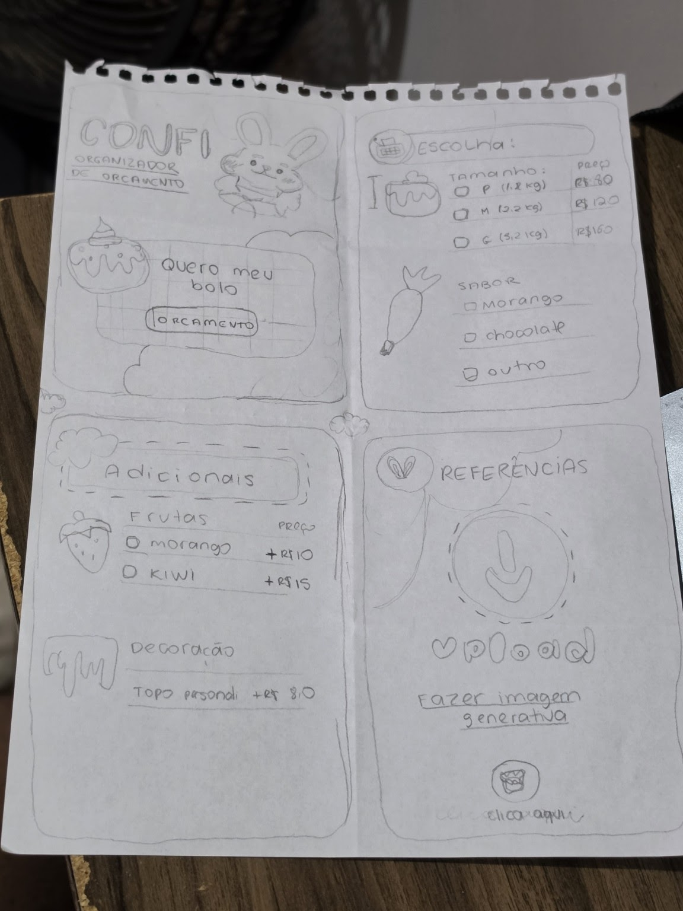
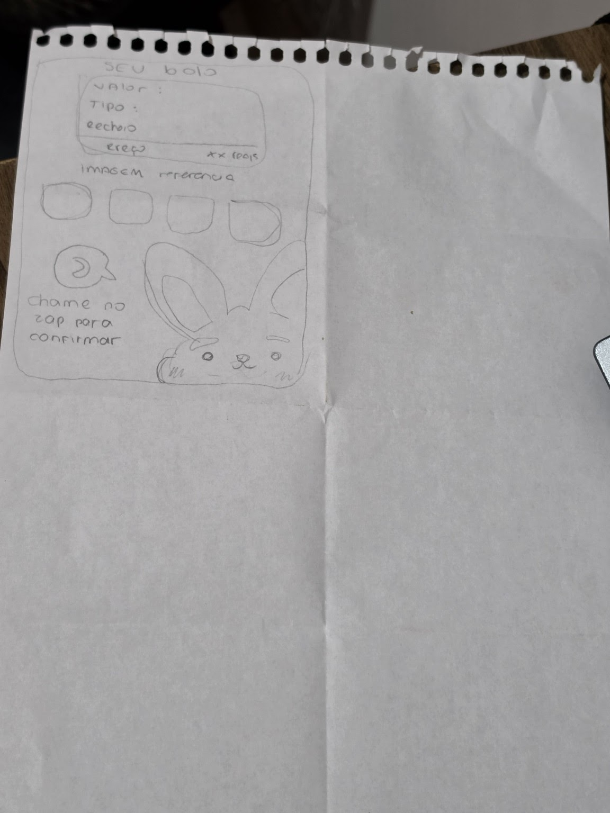
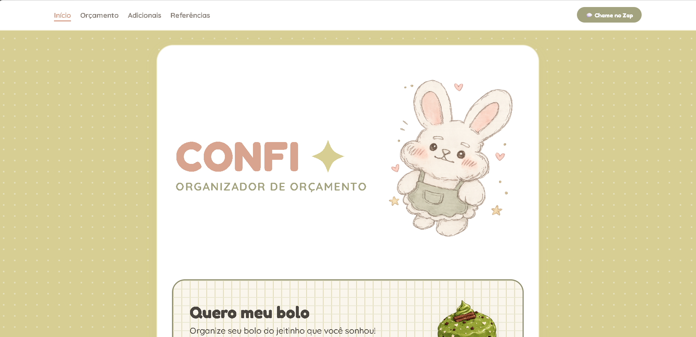
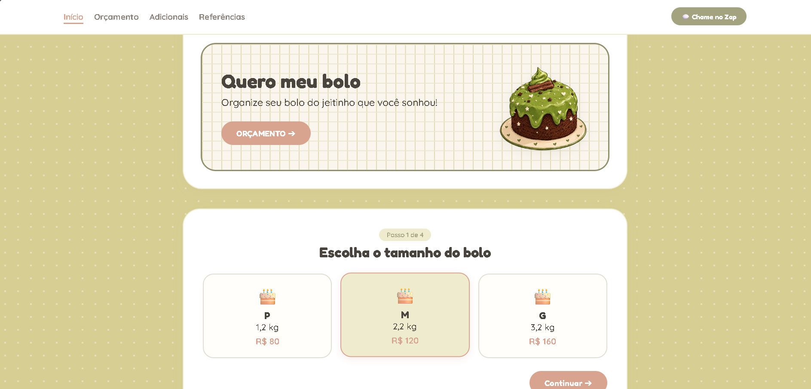
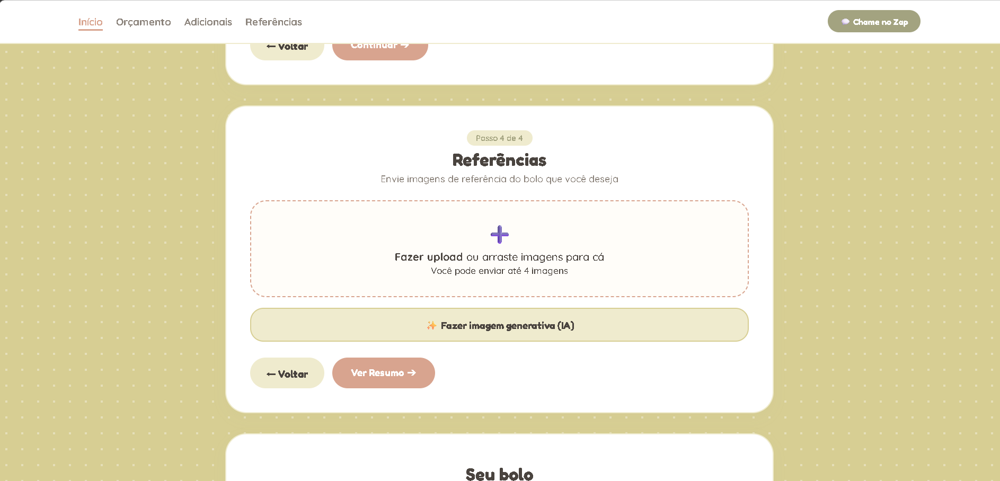
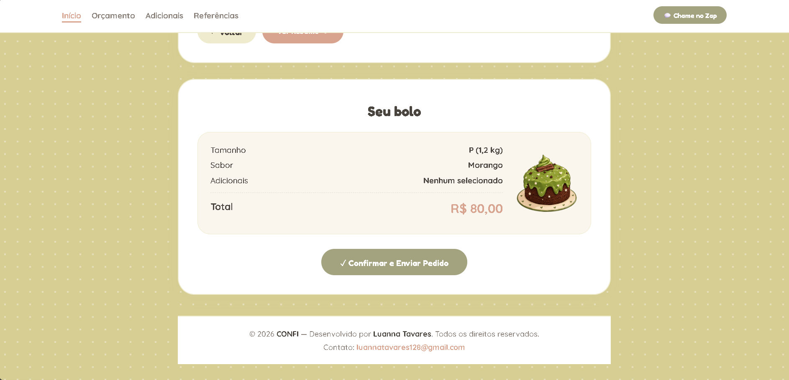

# 🍰 CONFI — Organizador de Orçamento para Confeitaria

> Um assistente digital e interativo de orçamento de bolos decorados, desenhado sob a perspectiva de **User Experience (UX)** e **UI Design**.

---

## 📌 Sobre o Projeto

O **CONFI** nasceu com a missão de simplificar a precificação e a escolha de bolos personalizados para clientes, reduzindo o ruído na comunicação entre o cliente e a confeiteira. A aplicação orienta o usuário passo a passo no processo de escolha de tamanho, sabor, adicionais e referências visuais.

---

## 🎯 Processo de UX & Product Design

Este projeto aplicou metodologias e aprendizados focados na experiência do usuário para transformar uma necessidade real em uma solução digital intuitiva:

### 🧠 1. Problema & Oportunidade
* **Dor do cliente:** Dificuldade em estimar custos e expressar o bolo desejado sem trocas infinitas de mensagens.
* **Dor da confeiteira:** Perda de tempo detalhando orçamentos repetitivos manualmente.

### 👤 2. Jornada do Usuário (User Journey)
1. **Descoberta:** O cliente entra no site atraído por um visual *Kawaii/Pastel* acolhedor.
2. **Configuração Passo a Passo:** Escolhe o tamanho, o sabor da massa e os adicionais em cards visuais claros.
3. **Personalização e Referência:** Faz upload da imagem de referência ou gera uma prévia com IA.
4. **Transparência e Resumo:** Visualiza o custo total atualizado em tempo real antes do envio.
5. **Conversão:** Envia a solicitação de pedido via WhatsApp com todos os dados preenchidos.

---

## 🎨 Design System, Wireframes & Galeria de Interface

### ✏️ Wireframes e Rascunhos Iniciais
*Abaixo estão os esboços e wireframes desenhados durante a etapa de ideação:*

| Rascunho Inicial 1 | Wireframe / Concepção 2 |
| :---: | :---: |
|  |  |

---

### 📸 Telas da Interface (Resultado Final)
*Visualização das etapas do formulário e protótipo funcional implementado:*

| Tela Inicial | Etapa 1 — Configuração |
| :---: | :---: |
|  |  |

| Etapa 2 — Seleção de Opções | Resumo do Orçamento |
| :---: | :---: |
|  |  |

---

### 🎨 Paleta de Cores (Pastel & Kawaii)
* **Olive Petal:** `#A3A380` (Acentos e botões de ação final)
* **Rose Blush:** `#D8A48F` (Botões principais e preço)
* **Artic Daisy:** `#EFEBCE` (Bordas e destaques)
* **Golden Clover:** `#D7CE93` (Brilhos e fundo)

---

## 🛠️ Tecnologias Utilizadas

* **HTML5:** Estrutura semântica e acessível (com marcações `aria-*` e formulários estruturados).
* **CSS3:** Flexbox, CSS Grid, variáveis nativas (`:root`), padrão de fundo quadriculado e responsividade.
* **UX/UI Prototyping:** Wireframing e design centrado no usuário.

---

## 👤 Autora & Direitos Autorais

Concebido, desenhado e desenvolvido por **Luanna Priscila da Silva Tavares**.

* **Autora:** Luanna Priscila da Silva Tavares
* **Contato:** [luannatavares128@gmail.com](mailto:luannatavares128@gmail.com)
* **Ano:** 2026

*© 2026 CONFI. Todos os direitos reservados. Nenhuma parte deste projeto pode ser copiada ou reutilizada sem autorização prévia.*
